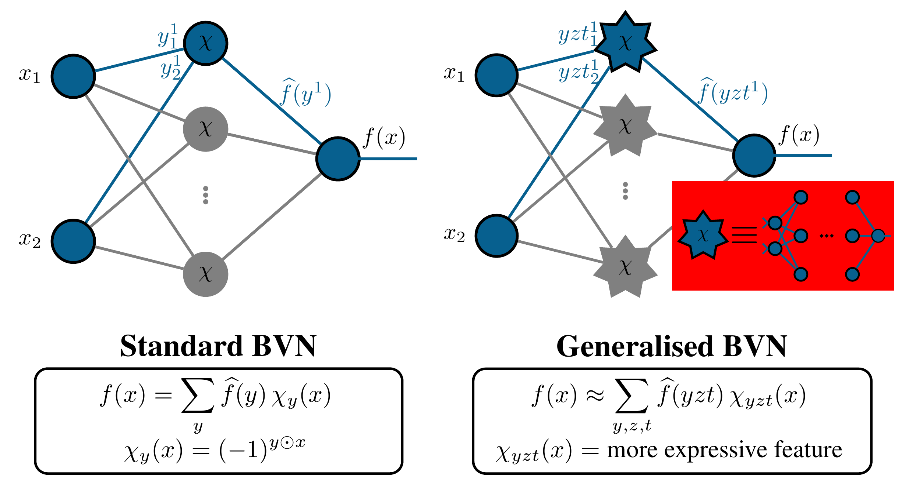
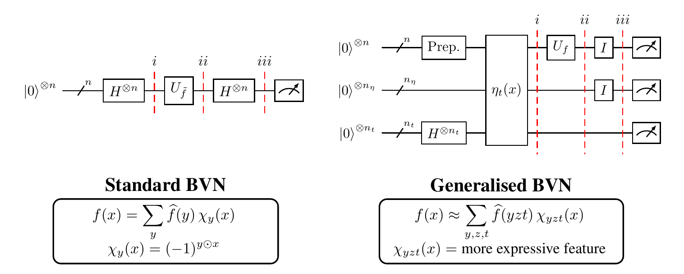

# Bernstein-Vazirani Networks: Quantum Machine Learning by Interference
This code can be used to reproduce the experiments and results of our paper  
**Bernstein-Vazirani Networks: Quantum Machine Learning by Interference**.

    @article{meli2026bernstein,
      title={Bernstein-Vazirani Networks: Quantum Machine Learning by Interference},
      author={Meli, Natacha Kuete and Birdal, Tolga and Tiwari, Prayag and Golyanik, Vladislav and Moeller, Michael},
      journal={arXiv preprint arXiv:2608.19043},
      year={2026}
    }

We introduce Bernstein-Vazirani Networks (BVNs), a non-variational quantum machine learning framework that leverages quantum interference for supervised learning, demonstrated on vision and representation learning tasks. 
In their standard form, BVNs follow the principle of quantum Fourier sampling: 
labelled data are placed in superposition and interfered in the Fourier basis to extract globally informative features. 
We then define generalised BVNs that enable interference in problem-adapted bases, yielding more expressive models under the same measurement budget as in the standard setting. 
BVNs achieve universal function approximation through (over)complete interference bases, while training of BVNs is gradient-free. 
Experiments on synthetic and real-world classification tasks, as well as implicit image representation, show strong generalisation capabilities and competitive performance with classical and quantum baselines.

	
	

# Install
The code depends on the Python packages 
[numpy](https://numpy.org/install/), 
[torch](https://pytorch.org/),
[pennylane](https://pennylane.ai/install);
(for noise simulation)
[pennylane plugin for qiskit](https://github.com/XanaduAI/pennylane-qiskit),
[qiskit](https://www.ibm.com/quantum/qiskit),
[qiskit-aer](https://github.com/Qiskit/qiskit-aer);
and (for plots)
[matplotlib](https://pypi.org/project/matplotlib/).

- Please download the repository and install the requirements in `requirements.txt` or refer to the product pages for reference.

- Once you satisfied the dependency, run `python -m pip install .` inside the directory.

Move to the `src` folder to run the subsequent commands.

# Example

    # Run BVNs on some test learning cases
    python bvn_relu_act.py         # BVN with Reversible ReLU-MLP as expressive representation
    python bvn_rect_act.py         # BVN with Rectangles as expressive representation
    python bvn_img_fitting.py      # BVN with Rectangles as expressive representation on image representation

# Citation
If you find this work useful, please cite the article [Article URL](#).
